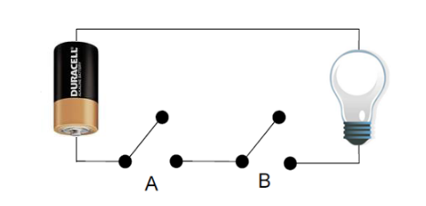
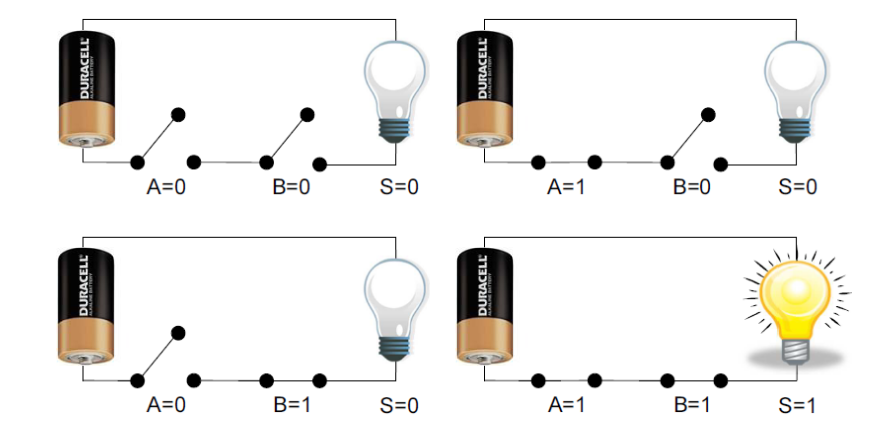
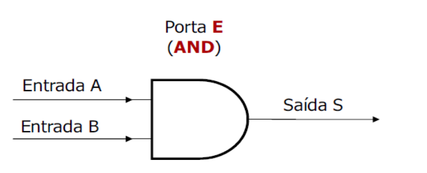
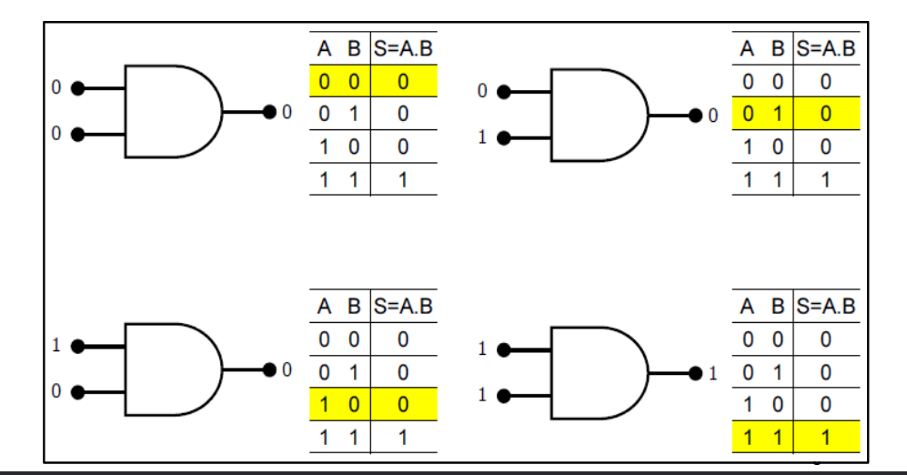
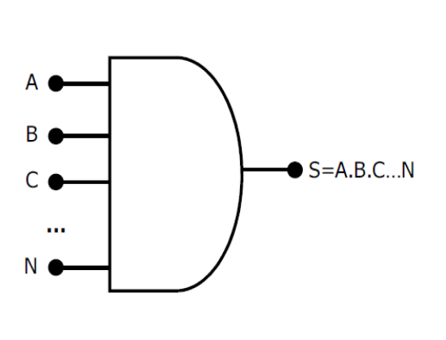
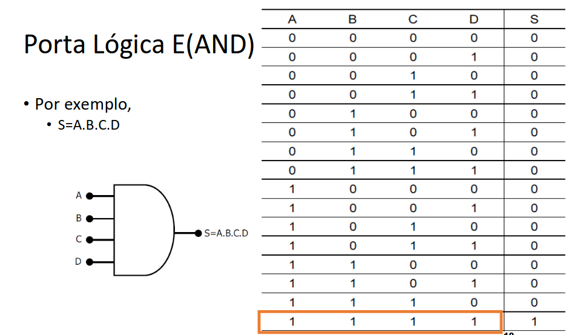

# Porta Logica E (AND)

- Executa a multiplicação (conjunção, circuito em série) booleana de
  duas ou mais variáveis binárias

- Por exemplo, assuma a convenção no circuito:

  - Chave aberta = 0; Chave fechada = 1
  - Lâmpada apagada = 0; Lâmpada acesa = 1
  - Figura: pilha e
  - lâmpada conectados
  - com duas portas

  

## Situações possíveis

- Para representar a expressão
  - S = A e B
- Adotaremos a representação - S = A.B, onde se lê S = A e B

- Porém, existem notações alternativas

  - S = A & B

  - S = A, B

  - -S = A ^ B

## Tabela Verdade

As possibilidades das variáveis são representadas de forma tabular e
chama-se o conjunto de Tabela Verdade.

- Cada operação lógica possui sua própria tabela verdade, estabelecida
  de acordo com a regra que define a respectiva operação lógica.
- De um modo geral, a tabela verdade de uma dada operação lógica
  possui 2n linhas ou combinações de valores de entrada, sendo n igual
  à quantidade de elementos de entrada.
  - Exemplo anterior, para 2 variáveis booleanas (A e B), há 4 interpretações
    possíveis;
  - Para 3 entradas são 8 interpretações

## Tabela Verdade da Função E(AND)

.png>)

## Porta Lógica E(AND)

- A porta E é um circuito que executa a função E
- A porta E executa a tabela verdade da função E
- Portanto, a saída será 1 somente se ambas as entradas forem iguais a 1; nos
  demais casos, a saída será 0
- Representação

- É possível estender o conceito de
  uma porta E para um número
  qualquer de variáveis de entrada

- Nesse caso, temos uma porta E
  com N entradas e somente uma
  saída

- A saída será 1 se e somente se as
  N entradas forem iguais a 1; nos
  demais casos, a saída será 0

## Resumo

**A porta lógica AND (representada como E) é um componente básico da eletrônica digital. Ela realiza uma operação lógica que só resulta em "verdadeiro" (1) se todas as entradas forem "verdadeiras" (1). Se qualquer entrada for "falsa" (0), a saída será "falsa" (0). A porta AND é frequentemente usada em circuitos onde todas as condições precisam ser atendidas para que uma ação ocorra.**

